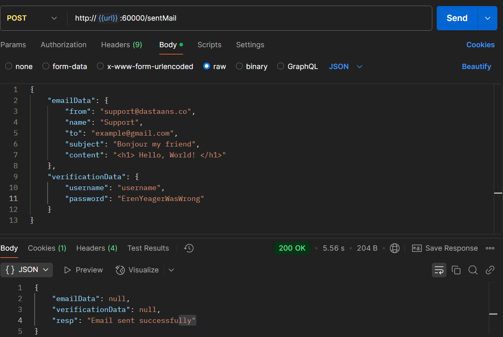
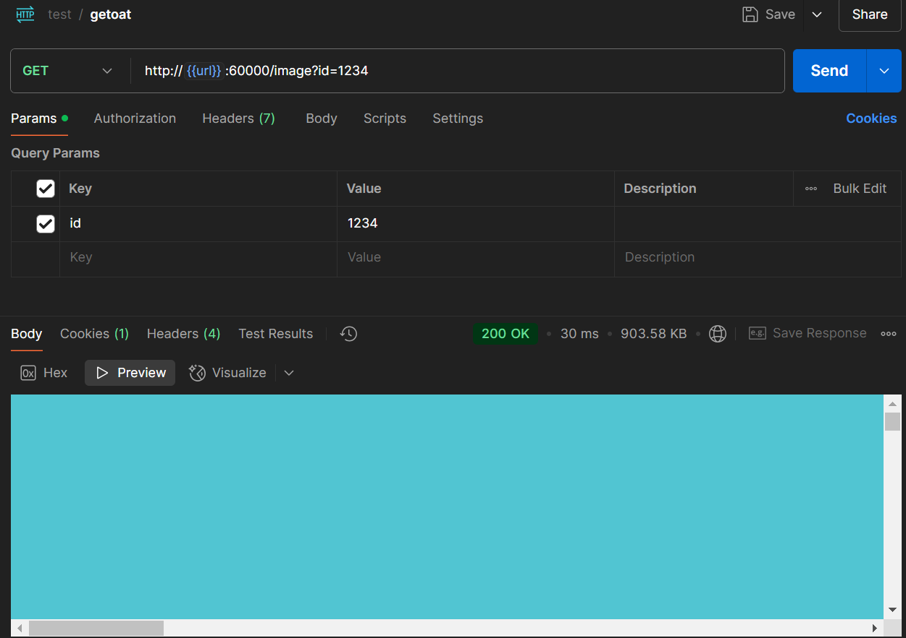

# Dastaans: A Journey of Stories

Several months, perhaps a year ago, an extraordinary idea dawned upon me. To me, it was a brilliant revelation. It seemed as if the path leading to this idea was merely a detour from the main road I longed to tread—the road that would have taken me to the place I've always yearned to be. Yet, I couldn't reach that destination, and all I was left with was an abstract notion, a fleeting echo of the journey I had hoped to pursue, one that still makes me feel as if I'm wandering that cherished path.

And here I am, perhaps deceiving myself, sailing across the vast ocean, wherever these waves may carry me. This is the journey of Dastaans, a tale unfolding upon the boundless sea.

## What is Dastaans?

I dream of a social media platform where users can share their stories. Initially, you can call it Dastaans 1.0. Sadly, it ended with a heartache. I thought it wouldn't be so difficult, but I rushed, and everything fell apart. Dastaans 1.0 was just a platform where users could write stories that would be shared posthumously or at a specific time with someone they had designated. But now, I envision a new Dastaans—a social media platform for writers, retaining the legacy-sharing feature. This time, I will make it open-source and architect it with microservices.

## Features of Dastaans 2.0

- **Story Sharing**: Users can create and share their stories.
- **Legacy Sharing**: Users can schedule their stories to be sent to someone after a certain time or upon their inactivity.
- **Microservice Architecture**: The system is being built with a microservice approach.
- **Open-Source**: Dastaans 2.0 is open-source and free for everyone (until I can afford).

## Email Service Microservice

Here is the first microservice of Dastaans—the email service. It undoubtedly has some bugs, as it has been a while since I worked with C++. Even then, I only knew the basics, but it was my favorite language. I will keep improving it. It may not have a plethora of features, but I aim to make it simple, yet powerful. I doesn't have some mechanism of password hashing, as it will be run locally. And as for the tracking url, another service that will have exposure to internet, will send request to this service. I have included the mechanism for database creation in it. Not a good thing to do. But I hate to configure things.

## Request Body Example

The body of the request should follow this structure. Below are images showcasing the proper format.

### Image 1: [Body of Request 1](path/to/image1.jpg)



### Image 2: [Body of Request 2](path/to/image2.jpg)



## How to Run the Email Service

To run the email service microservice, follow these steps:

### 1. Install Dependencies

#### Install Oat:

Follow the installation instructions for **Oat** from its official site or package manager.

#### Install Vmime:

Follow the installation instructions for **Vmime** from its official site or package manager.

#### Install pqxx

I dont know, maybe sudo get install something. Google it.

### 2. Build
#### Create the build directory:

```bash
mkdir build 
```

#### Navigate into the build directory:

```bash
cd build
```
#### Run cmake to configure the build:

```bash
cmake ..
```
#### Compile the code using make:

```bash
make
```
#### Run the email service executable:

```bash
./email_service-exe
```
This will start the email service microservice on your local machine.
